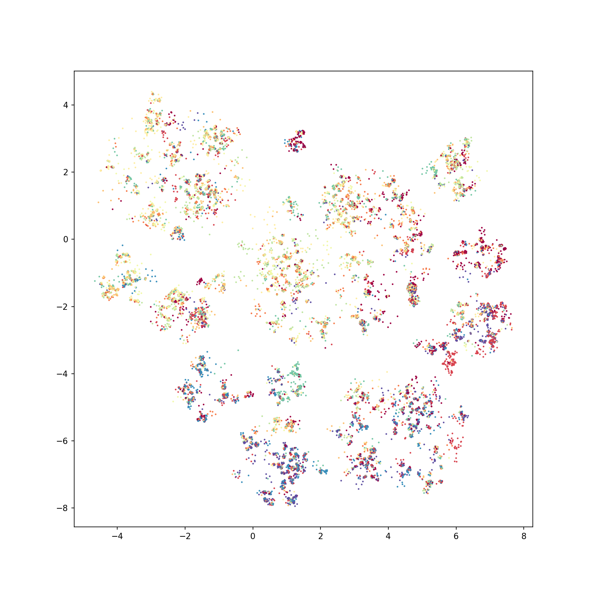

.. _getting_started:

Getting started
================

The main functionality of h-NNE is in the HNNE class. The algorithm aims to large datasets but keep in mind that the
data is loaded into memory before projection, thus you will need a server with enough RAM for your use case. Below is
a simple example of projecting the CIFAR-10 dataset to two dimensions.

First let's import the library along with torchvision which provides easy access to CIFAR-10. If you are missing some
dependencies, you can install them with pip:

.. code-block:: bash

    pip install matplotlib
    pip install torchvision
    pip install hnne

When all dependencies are there, you can load them:

.. code-block:: python

    import matplotlib.pyplot as plt
    from torchvision.datasets import CIFAR10

    from hnne import HNNE

Right after you can load CIFAR-10. Be aware, that the first time you load the dataset, torchvision will download it to
a local datapath. This is set to `'.'`, but you can change it to point to your preferred location (e.g. `/tmp`).

.. code-block:: python

    data_path = '.'
    cifar10_train = CIFAR10(root=data_path, download=True, train=True)
    data = cifar10_train.data.reshape((len(cifar10_train.data), -1))
    targets = cifar10_train.targets

Here comes the h-NNE part. Just load the HNNE class and call `.fit_transform` on the data.WARNING: malformed hyperlink target.

.. code-block:: python

    hnne = HNNE(verbose=True)
    projection = hnne.fit_transform(data)

Finally, you can visualize the result with matplotlib:

.. code-block:: python

    plt.figure(figsize=(10, 10))
    plt.scatter(*projection.T, s=1, c=targets, cmap='Spectral')
    plt.show()

An extended version of this example can be found at `this notebook`__.

.. __: https://github.com/koulakis/h-nne/blob/main/notebooks/demo1_basic_usage.ipynb
