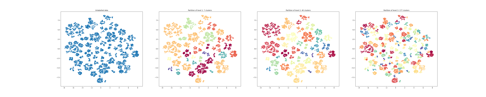

.. _projection_clusters:

Projection Clusters
===================

The hierarchy of the h-NNE is inspired by the FINCH clustering (https://github.com/ssarfraz/FINCH-Clustering).
This means that during the generation of the hierarchy a collection of partitions of the dataset is generated.
This set of partitions can be useful when one is dealing with unlabeled data. Using different levels of the hierarchy,
one can identify clusters which align with the h-NNE projection structure. We already presented the functionality in
the demo 1 notebook. Here we look at a more realistic scenario with a larger dataset containing no labels.
The dataset we use is a list of 3 million word embeddings of dimension 300 based on the Google news dataset.
WARNING: To run this code be sure to use a server with at least 64GB of RAM.

To install the required libraries with pip run:

.. code-block:: bash

    pip install gensim
    pip install matplotlib
    pip install hnne

Next, we will need the dataset. It can be downloaded from this website: https://code.google.com/archive/p/word2vec.
The file needed is 'GoogleNews-vectors-negative300.bin.gz', there is a link to it under the section
'Pre-trained word and phrase vectors'. Once the data is downloaded, one only needs to provide the correct path to
'GoogleNews-vectors-negative300.bin.gz' to the 'load_google_news' function.

Once you have the data, we can get started. First import the libraries:

.. code-block:: python

    from gensim import models
    import numpy as np
    import matplotlib.pyplot as plt

    from hnne import HNNE

Right after, load the data:

.. code-block:: python

    def load_google_news(data_path):
        return models.KeyedVectors.load_word2vec_format(
            data_path,
            binary=True
        ).vectors

    data_path = './GoogleNews-vectors-negative300.bin.gz'
    data = load_google_news(data_path)

Project the data with h-NNE:

.. code-block:: python

    hnne = HNNE()
    projection = hnne.fit_transform(data, verbose=True)

Along with the projected point, the partitions of all levels of h-NNE are available via the
`.hierarchy_parameters.partitions` attribute. Below we display the projected data labeled based on some of the top
level partitions:

.. code-block:: python

    partitions = hnne.hierarchy_parameters.partitions
    partition_sizes = hnne.hierarchy_parameters.partition_sizes
    number_of_levels = partitions.shape[1]

    _, ax = plt.subplots(1, 4, figsize=(10*(4 + 1), 10))

    ax[0].set_title('Unlabelled data')
    ax[0].scatter(*projection.T, s=1)

    for i in range(1, 4):
        partition_idx = number_of_levels - i
        ax[i].set_title(f'Partition of level {i}: {partition_sizes[partition_idx]} clusters')
        ax[i].scatter(*projection.T, s=1, c=partitions[:, partition_idx], cmap='Spectral')
    plt.show()

This clustering can be used to improve visualization or even preprocess the data. No matter which dimension you
project to, the same partitions will be used by h-NNE.

An extended version of this example can be found at `this notebook`__.

.. __: https://github.com/koulakis/h-nne/blob/main/notebooks/demo3_clustering_for_free.ipynb
